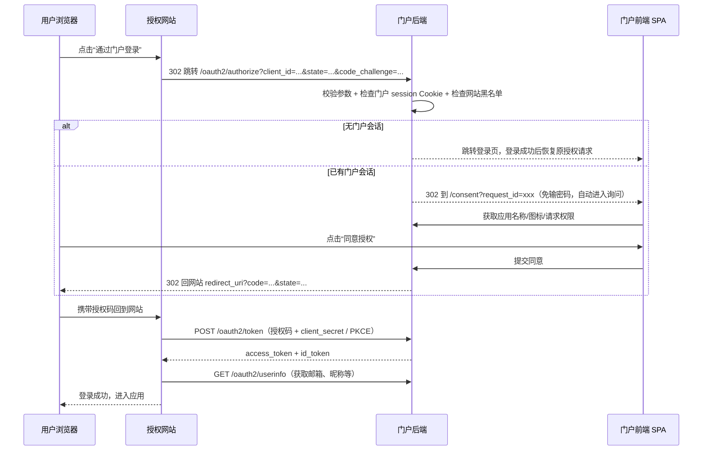
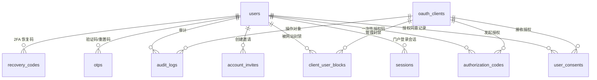

# 统一登录门户（LinPass SSO）设计文档

- 日期：2026-08-12
- 状态：已实施完成（2026-08-12）；最终行为以仓库代码与 [docs/deployment.md](../deployment.md)、[docs/oidc-integration.md](../oidc-integration.md) 为准
- 同步：本文件已于 2026-08-13 按仓库代码核对更新
- 技术栈偏好：Python

## 1. 项目概述

构建一个统一登录门户（SSO 身份提供商）：用户使用一个账号（邮箱 + 密码）注册后，即可直接登录所有由门户授权的网站。门户负责记录用户基础信息、认证、授权确认和访问控制；授权网站通过标准 OIDC/OAuth2 协议接入。

核心价值主张：

1. 用户注册一次，登录所有授权网站，不需要重复注册和记忆多套密码。
2. 授权网站按标准协议接入，无需自建认证体系。
3. 门户是用户身份的源头（唯一档案），可对每个网站独立控制账号访问权限。

## 2. 技术选型

| 层次 | 选型 | 说明 |
| --- | --- | --- |
| 后端框架 | FastAPI + Pydantic v2 | 异步、自带 OpenAPI 文档 |
| ORM/迁移 | SQLAlchemy 2.0 + Alembic | 数据模型与迁移 |
| 前端 | React 19 + Vite 8 + TypeScript + Tailwind CSS 4 | 动效生态最丰富（Motion、shadcn/ui、Aceternity UI、Magic UI） |
| 数据库 | PostgreSQL 16 | 主数据存储 |
| 缓存 | Redis 7 | 验证码、2FA 挑战、限流计数、待授权请求 |
| OIDC 实现 | 自研协议端点；JWT 用 PyJWT，密钥生成用 cryptography | 核心端点自行实现，保证可控可扩展 |
| 密码哈希 | Argon2id | 通过 argon2-cffi 或 passlib 接入 |
| TOTP | pyotp + qrcode | 认证器二次验证 |
| 邮件 | 抽象层：开发环境控制台打印，生产 SMTP（`EMAIL_BACKEND=console|smtp`） | 不绑定单一供应商 |
| 部署 | Docker Compose + 内置 nginx 单域名网关 | gateway（:80）为唯一对外入口；HTTPS 与路由由部署环境（K8s Ingress / 云负载均衡 / 外部网关）负责 |
| 测试 | pytest + httpx（后端）、Vitest + React Testing Library（前端） | 含完整 OIDC 流程集成测试 |

## 3. 整体架构与项目结构

采用单仓库、前后端分离结构，前端和后端可独立开发、独立部署。

```
portal-oss/
├── backend/                 # FastAPI 认证服务
│   ├── app/
│   │   ├── api/             # REST API 与 OIDC 端点（routes/oidc.py）
│   │   ├── models/          # SQLAlchemy 模型
│   │   ├── schemas/         # Pydantic 校验模型
│   │   ├── security/        # 密码哈希、JWT、TOTP、限流、审计
│   │   ├── services/        # 邮件、会话、2FA、黑名单等业务服务
│   │   └── core/            # 配置、数据库、日志
│   ├── scripts/             # 运维脚本（已内置进镜像）
│   └── tests/               # 仅保留本地，不入库
├── frontend/                # React SPA 门户
│   ├── src/
│   │   ├── pages/           # 登录、注册、找回密码、授权确认、用户中心、应用广场、管理后台
│   │   ├── api/             # API 客户端
│   │   ├── components/
│   │   └── hooks/
│   └── 测试目录（本地）
├── examples/demo-site/      # 示例授权网站（演示 OIDC 接入）
├── gateway/                 # 单域名 nginx 网关（/ 前端、/api /oauth2 后端、/demo 演示站）
├── scripts/                 # PostgreSQL 备份/恢复脚本
├── design-system/           # 设计系统说明与预览
├── docs/                    # 对接文档与设计文档
└── docker-compose.yaml      # gateway + frontend + backend + postgres + redis
```

本仓库内置 `gateway`（nginx）作为**唯一对外入口**：前端、后端与演示站都不向宿主机映射端口，仅在容器内网互通；生产环境的 HTTPS、域名路由与 TLS 终止由部署环境（K8s Ingress、云负载均衡或外部网关）负责，终止后转发到 gateway 的 80 端口。门户会话 Cookie 为 HttpOnly，开发默认 `SameSite=Lax`；跨站部署（前后端完全不同域）时须配置 `SameSite=None; Secure`（详见 docs/deployment.md「SameSite 与部署拓扑」）。前后端通过 CORS 白名单互信；Cookie 只存在于门户后端域名，授权网站只持有标准令牌，凭据边界依然清晰。

## 4. 功能范围（第一版 MVP）

### 4.1 用户侧门户

- 注册：邮箱 + 密码，邮箱激活邮件验证账号；支持激活验证码重发（重发会作废旧码）。
- 邀请注册：管理员发送一次性邀请链接（7 天有效），受邀者设置昵称与密码后邮箱即时验证。
- 登录：邮箱 + 密码，支持“记住我”；忘记密码走邮箱重置。
- 二次验证（2FA）：邮箱验证码或 TOTP 认证器，用户自选开启；开启后可生成恢复码。
- 用户中心：修改昵称/头像、修改密码、查看登录设备、远程退出其他会话、管理 2FA、注销账号（手机绑定接口保留，前端暂未开放）。
- 应用广场：展示用户有权访问的授权网站（图标 + 名称 + 描述），点击直接进入。
- 授权确认页：已有门户会话时自动捕获会话，展示“XX 网站想获取你的邮箱、昵称”，由用户同意或拒绝。

### 4.2 管理后台

- 用户管理：搜索（邮箱/昵称）、查看、禁用/启用、手动重置密码、重置用户 2FA、管理员代建账号、邀请注册/批量邀请、批量启用/禁用/删除（删除需管理员当前密码复核）。
- 授权网站管理：添加/编辑网站（名称、图标、描述、回调地址、首页地址、登出地址），生成 `client_id`/`client_secret`（可重置），启用/停用；配置“是否每次都询问授权”。
- 网站账号黑名单管理：为每个授权网站添加/移除被封禁账号（管理界面按邮箱；API 支持邮箱或 `user_id`）。
- 审计日志：登录记录、授权记录、黑名单拦截记录、管理操作记录，支持查询。

### 4.3 授权网站接入能力

- 标准 OIDC 发现文档：`/.well-known/openid-configuration`。
- 授权码 + PKCE 流程（第一版只做授权码流程，不做隐式流程）。
- `userinfo` 返回用户基础信息（邮箱、昵称、头像等标准 claims）：按 scope 裁剪，
  `email` scope 返回 `email`/`email_verified`，`profile` scope 返回
  `nickname`/`name`/`picture`（头像绝对 URL）。access token 的 `aud` 指向
  userinfo 端点，`id_token` 的 `aud` 为 `client_id`。
- `id_token` 携带 `acr` 声明，区分普通登录与二次验证登录，供需要强认证的网站自行判断。
- 网站自助黑名单 API：网站用 `client_id + client_secret` 管理自己的账号黑名单。
- 对接文档 + 示例网站（Python 小应用）。

### 4.4 第一版明确不做

- 微信/Google 等第三方登录
- Passkey/无密码登录
- 登录风控（异常地点/设备检测）
- 多租户/组织管理
- 短信供应商接入（手机绑定界面暂未开放，后端接口保留）
- SAML、OAuth 隐式流程、设备授权流程
- 全局单点登出（`end_session`；当前仅支持应用配置 `logout_uri`，用户取消授权时跳转登出）
- 邮箱验证后自动回到原授权同意页（当前未验证邮箱的用户被 302 到验证页后会丢失原授权上下文，需从接入网站重新发起授权；后续可把待授权请求挂起，验证完成后自动跳回同意页）

## 5. 核心流程

### 5.1 注册与激活

1. 用户提交邮箱 + 密码 + 昵称。
2. 后端创建 `status=active` 但 `email_verified_at` 为空的用户，生成邮箱激活码（`otps`，purpose=register，10 分钟有效）。
3. 邮件服务发送 6 位激活验证码；门户提供重发按钮（重发会作废旧码）。
4. 用户激活后 `email_verified_at` 写入；未验证邮箱不能开启邮箱 2FA。
5. 未验证邮箱的用户可以登录门户，前端会提示“完成验证后才能授权登录接入网站”并引导到激活页；后端 `/oauth2/authorize` 在请求含 `email` scope 时强制校验 `email_verified`，未验证用户被引导到验证邮箱页。

### 5.2 登录与 2FA

第一步：邮箱 + 密码校验通过后，检查用户是否开启 2FA。

- 未开启：直接建立门户会话（`sessions` + HttpOnly Cookie）。
- 已开启：后端创建 2FA 挑战（默认 Redis，开发可用内存；10 分钟有效），返回可用方式（邮箱验证码 / TOTP / 恢复码）。

第二步：

- 邮箱验证码：后端通过邮件发送 6 位验证码（`otps`，purpose=2fa），用户输入后校验。
- TOTP：用户输入认证器中的 6 位动态码，后端用用户绑定的 TOTP 密钥校验。
- 验证码错误超过 5 次，挑战作废，需要重新从第一步开始。

校验通过后建立门户会话，并在会话中记录本次认证方式（`auth_method`：password / email_otp / totp）。后续 OIDC 授权发放 `id_token` 时，`acr` 声明根据该会话的认证方式标记为 1FA 或 2FA。

### 5.3 OIDC 授权流程（含自动捕获与授权确认）



规则：

- 已授权过且权限未变化的用户，默认免询问直接放行；授权网站可在后台配置“每次都询问”。
- 首次授权必定展示授权确认页。
- 授权确认页的待处理请求用 `request_id` 存于待授权请求存储（默认 Redis，开发可用内存；10 分钟有效），同意/拒绝均绑定原始请求参数（state、redirect_uri、code_challenge），拒绝时按规范跳回 `error=access_denied&state=...`。
- 授权码一次性、10 分钟过期，换令牌时校验 `redirect_uri` 与 PKCE。

### 5.4 网站级账号访问限制（黑名单）

- 数据表 `client_user_blocks` 保存每个网站的封禁账号（按 `user_id` 或 `email`）。
- 三层强制拦截：
  1. `/oauth2/authorize`：命中黑名单则不进入授权确认，跳回 `redirect_uri` 并带 `error=access_denied&error_description=account_blocked`。
  2. `/oauth2/token`：换令牌时再次校验。
  3. `/oauth2/userinfo`：取用户信息时再次校验，保证封禁即时生效。
- 管理入口：门户管理后台 + 网站自助 API（`client_id + client_secret` 鉴权）。
- 每次拦截写入审计日志。

### 5.5 TOTP 开启与恢复码

1. 用户中心进入安全设置，选择开启 TOTP。
2. 后端生成 TOTP 密钥，返回 `otpauth://` URI 与二维码。
3. 用户用认证器扫码，输入当前验证码确认，成功后启用。
4. 启用后生成 10 个一次性恢复码，仅展示一次，存储使用带服务端密钥的 HMAC 哈希。
5. 修改或关闭 2FA 必须通过当前密码或已有 2FA 验证。

## 6. 数据库设计



### users（用户档案）

- `id` UUID 主键；`email` 唯一索引（账号主键）；`email_verified_at`
- `password_hash`（Argon2id）；`nickname`；`avatar_url`
- `phone` 可空唯一；`phone_verified_at`
- `role`（user / admin）；`status`（active / disabled）
- `totp_secret_encrypted`（Fernet 加密存储）、`totp_enabled_at`、`email_otp_enabled`
- `created_at`、`updated_at`、`last_login_at`、`last_login_ip`

### oauth_clients（授权网站/应用）

- `client_id` 公开标识（唯一）；`client_secret_hash`（只存哈希）
- `name`、`description`、`logo_url`
- `redirect_uris`（JSON 数组白名单）；`home_url`、`logout_uri`；`scopes`；`require_consent_every_time`（默认 false）
- `is_active`；创建/更新时间

### user_consents（用户对网站的授权记录）

- `user_id` + `client_id` 联合唯一；已同意 scopes；首次/最近同意时间

### sessions（门户自身登录会话）

- `user_id`、会话令牌哈希、设备名、IP、User-Agent
- `auth_method`（password / email_otp / totp / recovery，用于生成 acr 声明）
- `expires_at`、`revoked_at`、`last_used_at`

### authorization_codes（OIDC 一次性授权码）

- `code_hash`、`client_id`、`user_id`、`redirect_uri`、`scope`、`nonce`
- `auth_method`（签发时记录会话认证方式，用于 token 端点生成 acr 声明）
- PKCE 的 `code_challenge` + `method`
- `expires_at`（10 分钟）、`consumed_at`（一次性）

### account_invites（邀请注册）

- `email`、`nickname`（可空）、`token_hash`（SHA-256）、`created_by`
- `expires_at`（7 天）、`used_at`（原子消费，防并发重复建号）、`created_at`

### otps（一次性验证码）

- `purpose`（register / reset_password / bind_phone / 2fa）
- `target`（邮箱或手机号）；`code_hash`、`expires_at`、`consumed_at`、尝试次数

### recovery_codes（2FA 恢复码）

- `user_id`；`code_hash`（带服务端密钥的 HMAC 哈希）；`used_at`；一次性使用

### client_user_blocks（网站账号黑名单）

- `client_id` + `user_id`（可空）+ `email`（可空），至少填一项；组合索引 `(client_id, user_id)` 与 `(client_id, email)`，同一网站重复封禁由服务层 `add_block` 校验拒绝
- `reason`、`created_at`（操作者由审计日志记录）

### audit_logs（审计日志）

- 操作者（用户/管理员）、动作、目标对象、IP、User-Agent、详情 JSON、时间

### 关键决策

- access token 用短时效 JWT（15 分钟）不落库；当前无刷新令牌，令牌过期前无法主动吊销，停用/封禁等通过 token/userinfo 端点实时校验兜底。
- 授权码、邀请令牌、client_secret 存 SHA-256 哈希；验证码、恢复码等低熵值用带服务端密钥的 HMAC-SHA256。
- TOTP 密钥必须可恢复用于校验，因此用 Fernet（基于加密密钥文件）加密存储。
- 邮箱是唯一账号主键，手机号只是可绑定项。

## 7. API 设计

### 标准 OIDC 端点（授权网站使用）

- `GET /.well-known/openid-configuration`：发现文档
- `GET /oauth2/authorize`：发起授权（授权码 + PKCE）
- `POST /oauth2/token`：换令牌
- `GET /oauth2/userinfo`：获取用户信息
- `GET /oauth2/jwks`：JWT 公钥

当前无刷新令牌与 `/oauth2/revoke` 端点；`access_token`（15 分钟）与 `id_token`（5 分钟）到期即失效。

### 授权确认（门户前端使用）

- `GET /consent?request_id=...`：授权确认页（SPA 路由）
- `GET /api/v1/consent/{request_id}`：获取应用信息与请求的 scopes
- `POST /api/v1/consent/{request_id}/approve`：同意（返回跳回 `redirect_uri` 的地址）
- `POST /api/v1/consent/{request_id}/deny`：拒绝（返回 `error=access_denied` 跳转地址）

### 用户侧 API

- 注册/登录：`POST /api/v1/auth/register`、`POST /api/v1/auth/email/verify`、`POST /api/v1/auth/email/verify/resend`、`POST /api/v1/auth/invite/register`
- 登录：`POST /api/v1/auth/login`、`POST /api/v1/auth/logout`、`POST /api/v1/auth/2fa/send`、`POST /api/v1/auth/2fa/verify`
- 密码：`POST /api/v1/auth/password/reset`、`POST /api/v1/auth/password/reset/confirm`
- 资料：`GET /api/v1/me`、`PUT /api/v1/me`、`POST /api/v1/me/avatar`、`POST /api/v1/me/password`、`POST /api/v1/me/delete`（注销账号）
- 手机（接口保留）：`POST /api/v1/me/phone/bind/send`、`POST /api/v1/me/phone/bind`
- 2FA：`GET /api/v1/me/2fa/status`、`POST /api/v1/me/2fa/email/enable|disable`、`GET /api/v1/me/2fa/totp/setup`、`POST /api/v1/me/2fa/totp/enable|disable`
- 会话与应用：`GET /api/v1/sessions`、`DELETE /api/v1/sessions/{id}`、`GET /api/v1/apps`、`DELETE /api/v1/apps/{client_id}`（取消授权，可返回 `logout_uri`）

### 网站自助 API（HTTP Basic：client_id + client_secret）

- `GET /oauth2/client/blocks`：查询本网站黑名单
- `POST /oauth2/client/blocks`：封禁（`email` 或 `user_id`）
- `DELETE /oauth2/client/blocks/{block_id}`：解封

### 管理后台 API

- 用户：`GET/POST /api/v1/admin/users`、`PATCH /api/v1/admin/users/{id}`、`POST /api/v1/admin/users/{id}/reset-password`、`POST /api/v1/admin/users/{id}/reset-2fa`、`POST /api/v1/admin/users/{id}/delete`
- 邀请：`POST /api/v1/admin/users/invite`、`POST /api/v1/admin/users/batch/invite`
- 批量：`PATCH /api/v1/admin/users/batch`、`POST /api/v1/admin/users/batch/delete`
- 应用：`GET/POST /api/v1/admin/clients`、`GET/PATCH/DELETE /api/v1/admin/clients/{id}`、`POST /api/v1/admin/clients/{id}/reset-secret`
- 黑名单：`GET/POST /api/v1/admin/clients/{id}/blocks`、`DELETE /api/v1/admin/clients/{id}/blocks/{block_id}`
- `GET /api/v1/admin/audit-logs`

## 8. 安全设计

### 凭据与数据安全

- 密码 Argon2id；client_secret、授权码、邀请令牌存 SHA-256 哈希；验证码、恢复码等低熵值用带服务端密钥的 HMAC-SHA256。
- access token 用 RS256 签名 JWT，私钥只在后端（`/app/keys` 卷，首次启动自动生成）；授权网站用 JWKS 公钥验签。
- TOTP 密钥用 Fernet（加密密钥文件）加密存储。

### 会话与令牌

- 门户会话：HttpOnly Cookie；开发默认 `SameSite=Lax`，跨站部署（前后端完全不同域）必须 `None + Secure`；SPA 无法读取。
- “记住我”使用 30 天持久 Cookie；未勾选时使用 1 天会话级 Cookie（关闭浏览器即失效）；会话另有 7 天空闲超时，超时自动吊销。
- 授权码一次性、绑定 redirect_uri + PKCE code_challenge。

### 攻击防护

- 登录、验证码、重置密码、2FA 挑战全部限流（IP + 账号双维度，Redis 计数）。
- 登录按 IP 前置限流 + 邮箱/IP 计数（10 次/15 分钟）；2FA 挑战错误上限 5 次，超限作废；不做账号级冻结。
- `redirect_uri` 精确白名单匹配，防开放重定向。
- 授权确认请求绑定原始参数，防授权码串用。
- OIDC 流程校验 `state`；门户 SPA 同源 Cookie + SameSite 防 CSRF。
- 带会话 Cookie 的写请求必须声明允许的 Origin，否则拒绝（CSRF 兜底中间件）。
- 用户可输入内容只作文本渲染，不执行 HTML。
- 生产环境强校验：Cookie Secure、真实 HTTPS 来源、绝对密钥路径、Redis/数据库强口令等；JWT 私钥与 Fernet 密钥持久化在 `/app/keys` 卷，不进代码仓库。

### 审计

- 登录成功/失败、授权、黑名单拦截、2FA 变更、管理操作均写审计日志。

## 9. 部署方案

```
浏览器 → [部署环境的 HTTPS / 反向代理，不属于本仓库]
          → gateway（nginx :80，本仓库唯一对外入口）
              ├── 前端服务（容器内 :5173，React 静态资源）
              ├── 后端服务（容器内 :8000，FastAPI /api /oauth2）
              └── 演示站（容器内 :3001，/demo）
后端 → PostgreSQL 16 + Redis 7
```

- Docker Compose 服务：gateway、frontend、backend、postgres、redis（`bundle` profile）；演示站为 `demo` profile，默认不随生产栈启动。前端/后端/演示站不向宿主机映射端口。
- 单域名网关路由：`/` 前端、`/api`、`/oauth2`、`/.well-known`、`/healthz`、`/readyz`、`/uploads`、`/docs` 后端，`/demo/` 演示站。
- 前端通过 `VITE_API_BASE_URL` 指向后端地址（单域名网关模式留空，同源）；后端通过环境变量配置 CORS 白名单与 `PUBLIC_BASE_URL` 派生 `FRONTEND_BASE_URL` / `JWT_ISSUER`。
- 生产配置通过环境变量注入：数据库地址、Redis 地址、JWT 私钥、Fernet 加密密钥、邮件配置、CORS 白名单、Cookie 属性等。
- `/healthz`（存活）与 `/readyz`（就绪，含数据库/Redis 检查）供 Docker 探活；日志走容器 stdout（`docker compose logs`）。
- 提供 PostgreSQL 一键备份/恢复脚本（`scripts/backup-db.sh` / `scripts/restore-db.sh`）。
- 示例授权网站通过环境变量指向门户地址，一条命令起全套演示。

## 10. 测试策略

- 后端单元测试：密码哈希、JWT、TOTP、限流、参数校验。
- 后端集成测试：用 httpx 跑完整流程（注册 → 激活 → 登录 → 2FA → 授权 → 换令牌 → userinfo → 黑名单拦截）。
- 前端测试：Vitest + React Testing Library 覆盖登录、注册、授权确认、用户中心关键交互。
- 验收映射：每个里程碑的验收标准对应一组自动化测试用例。

## 11. 实施里程碑与验收标准

### 里程碑 1：项目骨架 + 基础账号体系

- 仓库结构、Docker Compose（Postgres + Redis）、FastAPI 后端骨架、React 前端骨架。
- 注册（邮箱 + 密码）、邮箱激活（开发环境控制台打印验证码）、登录/退出、门户会话 Cookie、找回密码。
- 验收：新用户注册 → 激活 → 登录 → 退出，本地可跑通。

### 里程碑 2：OIDC 核心流程

- 授权网站管理（后台添加应用、生成 client_id/secret）。
- authorize/token/userinfo/jwks/discovery 全套端点，授权码 + PKCE。
- 授权确认页：已有会话自动捕获 → 询问授权 → 同意后跳回网站；同意记录复用。
- 示例网站。
- 验收：从示例网站点“门户登录” → 登录/授权 → 跳回网站并拿到用户信息；第二次不再重复询问。

### 里程碑 3：用户中心 + 网站级访问控制

- 修改资料、绑定手机（接口保留，前端暂未开放）、设备/会话管理（查看、远程踢出）、应用广场、账号注销。
- 网站黑名单：后台管理 + 网站自助 API，authorize/token/userinfo 三层拦截。
- 验收：被拉黑账号从任何入口都无法进入该网站；网站可自行调用 API 封/解封。

### 里程碑 4：2FA + 安全加固

- 邮箱验证码 2FA、TOTP 开启/登录、恢复码；管理员重置 2FA。
- 限流、防暴力破解、审计日志、Cookie/Header 安全加固。
- 验收：两种 2FA 均可登录，恢复码可用，错误次数触发锁定，关键操作有审计。

### 里程碑 5：生产部署 + 对接文档

- 生产 Docker Compose（单域名 gateway、健康检查、环境变量、密钥注入）、数据备份说明；HTTPS 与 TLS 终止由部署环境负责。
- 完整的网站对接文档（OIDC 端点、示例代码）、README、演示数据。
- 验收：新机器一条命令启动全栈；示例网站在生产形态下完成完整登录闭环。

### MVP 整体验收标准

- 用户注册一次，即可通过门户登录所有已授权网站。
- 门户能自动捕获已有会话并询问授权；被拒绝的账号无法进入对应网站。
- 邮箱或 TOTP 二次验证可用，安全操作有审计。
- 管理员能管理用户、管理网站、管理黑名单、查看日志。

## 12. 未来扩展（第二版）

- 微信/Google 等第三方登录
- Passkey/无密码登录（python-webauthn）
- 登录风控（异常地点/设备检测）
- 组织/多租户与角色权限
- 强制 2FA 策略（管理员按全局或按网站要求 acr=2fa）
- 短信验证码接入
- 门户与网站之间的全局单点登出（end_session）
- API 令牌管理（面向应用的长期令牌）

## 13. UI 与设计系统约定（统一风格）

### 13.1 单一事实来源

| 层级 | 文件 | 职责 |
| --- | --- | --- |
| 品牌意图 | `design-system/portal-oss/BRAND.md` | 品牌定位、设计原则、视觉方向、氛围动效标准 |
| 落地规格 | `design-system/portal-oss/MASTER.md` | 令牌、组件、页面模式的实现快照 |
| 代码事实 | `frontend/src/index.css` + `frontend/src/lib/brand.ts` | 颜色/阴影/动效令牌、品牌文案与资源 |

冲突时以代码事实为准，但必须同步回写 MASTER.md 与 BRAND.md，防止文档漂移。

### 13.2 氛围动效

- 品牌背景氛围统一使用 `FloatingBackground`（纯 Canvas 循环飘动：Z 形 / 正方形 / 平行四边形），分页配置与交互联动（焦点减速、滚动风速、移动端减量）见[循环飘动氛围层设计](./2026-08-14-ambient-background-design.md)与 BRAND.md 第 4 章。
- 所有动效尊重 `prefers-reduced-motion`；微交互 150~300ms，氛围循环 25~90s 级；只动 `transform`/`opacity`（DOM 动效）或 Canvas 位图。

### 13.3 新页面 / 新组件约束

- 复用 `AuthShell` / `AppHeader` / `SiteFooter` / `card` / `btn` 等既有模式；确需新模式时先更新 MASTER.md。
- 组件内禁止硬编码颜色与文案：颜色走 `index.css` 语义令牌，文案走 `lib/brand.ts`。
- 图标统一 SVG（Heroicons/Lucide 风格），禁止 emoji 充当图标；可点击元素必须有 `cursor-pointer` 与可见焦点。
- 交付前执行 MASTER.md 的 Pre-Delivery Checklist（对比度 4.5:1、375/768/1024/1440 响应式、无横向滚动等）。
